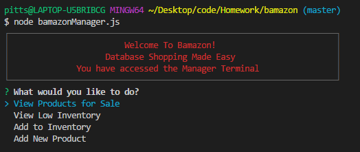
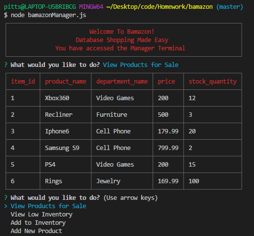

# bamazon

# Purpose

  Bamazon is a CLI based application that utilizes MySQL. It allows "customers" to purchase "items", and allows "Managers" to adjust "inventory".

# Node Packages

    mysql
    inquirer
    cli-table

# Instructions

  1. Clone repository

  2. Once you have the repository cloned open the file in your text editor of choice.

  3. Right click on the main bamazon file and select Open in Command Prompt/Terminal.

  4. Type 'npm install' and hit enter to install the necessary node packages.

  5. Copy the code in the schema.sql file and paste into MySQL Workbench or Pro MySQL to create the Database.

  Bamazon Customer

  Type 'node bamazonCustomer.js' in the terminal to run the Customer interface.

    1. When prompted input the item_id of the item you would like to purchase and hit enter:

  

    3. Input the how many you would like to purchase and hit enter:

  

    The following table will load when completed:

  

  You can now exit the application by holding now Ctrl/Cmd and hitting 'C'.

  Bamazon Manager

  Type 'node bamazonManager.js' in the terminal to run the Manager interface.

    1. The following will load:
      You have four options to choose from, use the arrow keys to select and item and hit enter:

      

      a. Selecting 'View Products for Sale' will load a familiar table to view what items are in stock:

  

      b. Selecting 'View Low Inventory' will load a table of items that have an inventory below five:

  

      c. Selecting 'Add to Inventory' will allow you to add to the inventory of a table:

        i. Follow prompts

  

      d. Selecting 'Add New Product' will allow you to add a new product to the inventory:
        i. Follow prompts
  

  You can now exit the application by holding now Ctrl/Cmd and hitting 'C'.